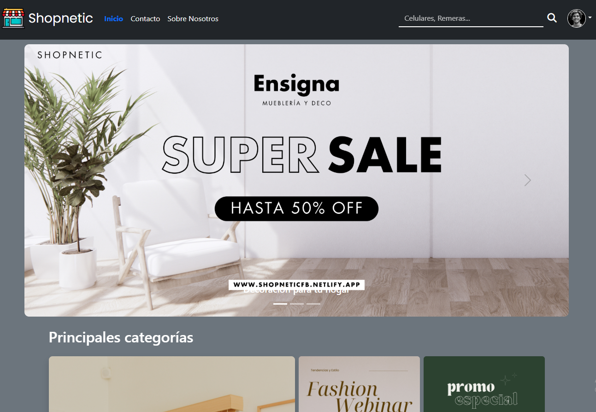

## Shopnetic Ecommerce



Este proyecto es un ecommerce desarrollado con el framework **React**, como trabajo final del curso de React de **Talento Tech**. El objetivo es aplicar los conocimientos aprendidos y sumar nuevas prácticas profesionales en el desarrollo frontend. 
Además, este proyecto cuenta con un backend diseñado y desarrollado por mí para cubrir las necesidades de la aplicación.
El repositorio está organizado en dos carpetas principales: frontend y backend, correspondientes a cada parte del sistema.

## 🚀 Deploy del sitio web

Puedes ver el proyecto en funcionamiento en este enlace:  
[🔗 Ver Demo](https://shopneticfb.netlify.app/)

#### 🧩 Backend

---

### 🔧 Instalación y configuración

1. Cloná el repositorio.

2. Abrí la carpeta backend con Visual Studio y permití que instale automáticamente las dependencias de NuGet.

3. Configurá el archivo appsettings.Development.json con tu ConnectionString.

4. Generá la base de datos desde el código (Code First) usando la consola del Administrador de Paquetes NuGet:

```bash
Add-Migration Initial

Update-Database
```

Esto cargará automáticamente productos y usuarios en la base de datos.

5. Para ejecutar el programa puedes usar el siguiente comando sobre la carpeta raiz del proyecto (carpeta shopnetic.api):

```bash
dotnet run
```

---

### 🚀 Funcionalidades principales

- Carrito de compras disponible para usuarios invitados y registrados.
- CRUD de usuarios, accesible únicamente para el administrador.
- Filtrado de productos mediante diversos parámetros.
- Registro de nuevos usuarios e inicio de sesión con sus credenciales.
- Implementación de JWT para reforzar la seguridad en el acceso a los recursos.

---

🛠️ Tecnologías y herramientas utilizadas en el backend

- 💻 C#

- 🛠️ .NET / Entity Framework Core

- 🗃️ SQL Server Management Studio

---

#### 🎨 Frontend

---

### 🔧 Instalación

1. Cloná el repositorio.
2. Ejecutá el siguiente comando para instalar las dependencias:

```bash
npm install
```

3. Luego, ejecutá el siguiente comando para correr la aplicación localmente (por defecto en `http://localhost:5173`):

```bash
npm run dev
```

---

### 🚀 Funcionalidades principales

- La aplicación permite cargar productos al carrito para luego finalizar la compra mediante un proceso de checkout.
- Navegación entre productos a través de filtros, búsqueda por nombre y paginación.
- Visualización de detalles de producto con opción de agregar múltiples unidades al carrito, además de mostrar productos relacionados por categoría.
- CRUD de usuarios (solo accesible para el usuario administrador).
- La aplicación permite ver las ordenes realizadas junto al estado de las mismas
- Inicio de sesión para usuarios registrados.
- Vista de perfil de usuario con sus datos personales.
- Diseño **responsive** que se adapta a todas las resoluciones de pantalla.

---

### 💡 Consejos

- **Usuario administrador:**
  - Email: `admin@example.com`
  - Contraseña: `1234`

- Para habilitar el **linter**, instalá la extensión `ESLint` en Visual Studio Code. Una vez instalada, ya estará activa sin requerir configuración adicional.

---

### 🛠️ Tecnologías y herramientas utilizadas

- Framework de estilos: **Bootstrap**
- Enrutamiento: **React Router**
- Manejo de estado global: **useContext**

---

❗ Importante
Este repositorio contiene tanto el backend como el frontend del proyecto.
Para su correcto funcionamiento, asegurate de configurar ambos entornos de forma independiente y seguir las instrucciones respectivas.

### Configuración de URLs
El frontend utiliza un archivo `src/constants/constants.js` donde están definidas las URLs del backend.

- Para ejecutar en local: cambiar la URL a `http://localhost:5281`.
- Para producción (deploy en Netlify): dejar la URL de producción `http://shopnetic.somee.com`.

---

¡Gracias por visitar este repositorio! 😊

