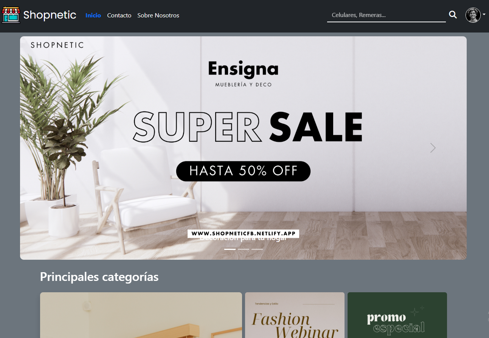

## Proyecto React Talento Tech



Este proyecto es un ecommerce desarrollado con el framework **React**, como trabajo final del curso de React de **Talento Tech**. El objetivo es aplicar los conocimientos aprendidos y sumar nuevas prácticas profesionales en el desarrollo frontend.

---

### 🔧 Instalación

1. Cloná el repositorio.
2. Ejecutá el siguiente comando para instalar las dependencias:

```bash
npm install
```

3. Luego, ejecutá el siguiente comando para correr la aplicación localmente (por defecto en `http://localhost:5173`):

```bash
npm run dev
```

---

### 🚀 Funcionalidades principales

- La aplicación permite cargar productos al carrito para luego finalizar la compra mediante un proceso de checkout.
- Navegación entre productos a través de filtros, búsqueda por nombre y paginación.
- Visualización de detalles de producto con opción de agregar múltiples unidades al carrito, además de mostrar productos relacionados por categoría.
- CRUD de usuarios (solo accesible para el usuario administrador).
- Inicio de sesión para usuarios registrados.
- Vista de perfil de usuario con sus datos personales.
- Diseño **responsive** que se adapta a todas las resoluciones de pantalla.

---

### 💡 Consejos

- **Usuario administrador:**
  - Usuario: `admin`
  - Contraseña: `1234`

- Para habilitar el **linter**, instalá la extensión `ESLint` en Visual Studio Code. Una vez instalada, ya estará activa sin requerir configuración adicional.

---

### 🛠️ Tecnologías y herramientas utilizadas

- API de productos: [https://dummyjson.com/](https://dummyjson.com/)
- API para usuarios: [https://mockapi.io/](https://mockapi.io/)
- Framework de estilos: **Bootstrap**
- Enrutamiento: **React Router**
- Manejo de estado global: **useContext**

---

¡Gracias por visitar este repositorio! 😊
